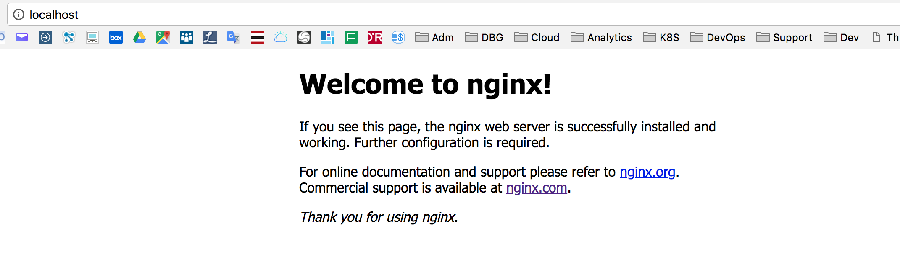

# Docker Lab

---


Duration : 30 minutes

## Prerequisites
This set of instructions requires that docker is already installed and docker commands can be run from a bash shell or a command line. You can get more information at the [Docker website](https://www.docker.com/get-docker)

**Note:** 

> This lab assumes that you have a Linux VM provided by the instructor. To get access to that provided VM (where ip address and labuser password are provided by the instructor):

`ssh labuser<xx>@ipaddress`

Or you can also use your own Docker running on your **laptop** with a recent version. 

**Don't forget to use your number <xx> in some instructions.** 


## Task 1 - Working with Docker


### 1. Check Docker version

Launch a shell or a command line and confirm that docker is installed.

The version number isn't particularly important.
However, you can see both the client (CLI) and the server (engine).

`docker version`

Output:

```bash
# docker version
Client: Docker Engine - Community
 Version:           19.03.8
 API version:       1.40
 Go version:        go1.12.17
 Git commit:        afacb8b7f0
 Built:             Wed Mar 11 01:25:46 2020
 OS/Arch:           linux/amd64
 Experimental:      false

Server: Docker Engine - Community
 Engine:
  Version:          19.03.8
  API version:      1.40 (minimum version 1.12)
  Go version:       go1.12.17
  Git commit:       afacb8b7f0
  Built:            Wed Mar 11 01:24:19 2020
  OS/Arch:          linux/amd64
  Experimental:     false
 containerd:
  Version:          1.2.13
  GitCommit:        7ad184331fa3e55e52b890ea95e65ba581ae3429
 runc:
  Version:          1.0.0-rc10
  GitCommit:        dc9208a3303feef5b3839f4323d9beb36df0a9dd
 docker-init:
  Version:          0.18.0
  GitCommit:        fec3683

```

The Docker version could be different. Notice that this version is compliant with containerd and runc. 


### 2. Run your first container

As with all new computer things, it is mandatory that we start with "helloibm".

> Please replace <xx> with your number. In the examples, I always specified 99 that doesn't exit.

`docker run phthom/helloibm<xx>`

Output:

```bash
# docker run phthom/helloibm99
Unable to find image 'phthom/helloibm99:latest' locally
latest: Pulling from phthom/helloibm99
Digest: sha256:9fc842c8dce0f91cf4d38920f165edf66916a5f24f8d10556e9e6477408db859
Status: Downloaded newer image for phthom/helloibm99:latest
Say Hello to IBM Clouds

```

   

The image was run and the result is "Say Hello to IBM Clouds".

 > Notice the message `Unable to find image 'phthom/helloibm99:latest' locally` First you see that the image was automatically downloaded without any additional commands. Second the version `:latest` was added to the name of the image. We did not specify a version for this image.


### 3. Rerun "helloibm" 

Notice that the image is not pulled down again. It already exists locally in your file system, so it is run.

`docker run phthom/helloibm<xx>`

Output:

```bash
# docker run phthom/helloibm99
Say Hello to IBM Clouds
```


### 4.  Show the image

List all your helloibm images that are stored locally:

 `docker images phthom/helloibm<xx>`

Output:

```bash
# docker images phthom/helloibm99
REPOSITORY          TAG                 IMAGE ID            CREATED             SIZE
phthom/helloibm99   latest              61174b19efe3        26 minutes ago      82.9MB
```


### 5. From where was the `helloibm` image pulled? 

Go to `https://hub.docker.com/r/phthom/helloibm<xx>` and you can read about this image. Docker-hub is a registry that holds docker images for use. Docker-hub is not the only registry, IBM Cloud Public can serve as a docker registry. You can also have (or define) private registries.


In a container registry, things can be organised in namespaces. "phthom" which is also my user name in Docker Hub, is my namespace. To get access to a specific image, you have to refer to **namespace/image:tag**. This rule can also be applied on other public or private clouds. 


### 6. Run a new container

This image is a typical image to get started with Docker. When an image is run it usually continues to run like for a database or a web server.  

The running image is called a **container**. Let us run a more typical image; This image contains a typical Node.JS web server with the express library. As there is no image containing Node.JS on your laptop or VM, you will first pull it from the Docker Hub and then once all the layers have been downloaded and extracted, you will run it.

Thanks to **Aco Vidovic** for his chat application (<https://github.com/Acovid/chat-app>) that we are using now:

`docker run -d -p 88<xx>:3000 phthom/chatibm<xx>`

Output:

```bash
# docker run -d phthom/chatibm99
Unable to find image 'phthom/chatibm99:latest' locally
latest: Pulling from phthom/chatibm99
df0176f97d41: Pull complete 
Digest: sha256:637e36d6120cbe20445a12675ffb7d1d241cd9b398b932a5d79d2a13ebbaec1b
Status: Downloaded newer image for phthom/chatibm99:latest
47b346f0cf21360328f292379524939aed3e9edfad29063de44f82f11798b699
```

When the download is complete,  you don't see anything from the container, like with helloibm. Instead you see a long hex id like `47b346f0cf21360328f292379524939aed3e9edfad29063de44f82f11798b699`. **This is the long id of the container**.

Also notice that the **-d** in the run command with launch the container as **detached** and so you can get the prompt when the command has been completed.

The **-p** stands for port mapping : in that case we will use the port 88<xx> outside of the container to map the internal application port (3000). 

If you go to your browser you will be able to get access to the application:

Get the **IP address** of the VM where you are running:

```bash
curl ifconfig.co
158.176.128.250
```

Then in your browser, type:

`http://<IPADDRESS>:88<xx>`

You should get :


You can play with this chat application. 


### 7. Look at the running container

Notice only the first part of that long hex id is displayed. Typically this is more than enough to uniquely identify that container. `docker ps` provides information about when the container was created, how long it has been running, then name of the image as well as the name of the container. Note that each container must have a unique name. You can specify a name for each container as long as it is unique.

`docker ps | grep chatibm<xx>` 

Output:

```bash
# docker ps | grep chatibm99              
CONTAINER ID        IMAGE               COMMAND                  CREATED             STATUS              PORTS                          NAMES
c4b9d38c11c4        phthom/chatibm99     "/nodejs/bin/node we…"   4 minutes ago       Up 4 minutes        3000/tcp            distracted_lederberg
```

You will notice that the name is auto-generated by Docker:  **distracted_lederberg**. So to avoid this, a good practice is to always give a name to a container with the **--name** parameter.


### 8. An image can be run multiple times 

Launch another container for the couchdb image.

`docker run -d phthom/chatibm<xx>`

Output:

```bash
# docker run -d phthom/chatibm99
2335bedc0fbb3cab083ed33c8b8ed2d24e56a6449f79008254a34571268377d9
```

Did you notice how quickly the second instance started? There was no need to download the image from the registry this time. The id of the container is shown after it has been started. You can notice that we are reusing all the layers already downloaded when we first pull the image.


### 9. Two web server containers  

`docker ps | grep chatibm<xx>`

Outpout:

```bash
# docker ps | grep chatibm99
2335bedc0fbb        phthom/chatibm99     "/nodejs/bin/node we…"   2 minutes ago       Up 2 minutes        3000/tcp            epic_perlman
04f150df58c4        phthom/chatibm99     "/nodejs/bin/node we…"   12 minutes ago      Up 12 minutes       3000/tcp            brave_ardinghelli
```

The IDs and the generated names will be different.


### 10. Similar web server instances 

The containers look similar, but they have unique names and unique ids. 

Stop one of the 2 containers and then check to see what's running.

`docker stop 04f150df58c4 `

Output:

```bash
# docker stop 04f150df58c4
04f150df58c4
```

Then check the container list:

`docker ps | grep chatibm<xx>`

Output:

```bash
# docker ps | grep chatibm99
2335bedc0fbb        phthom/chatibm99     "/nodejs/bin/node we…"   6 minutes ago       Up 6 minutes        3000/tcp            epic_perlman
```

So we still have one running container remainding in the list.

​    


### 11. Stop the other container

Stop the other container and see what is running.

 `docker stop 2335bedc0fbb`

 `docker ps | grep chatibm<xx>`

Output:

```bash
# docker docker ps | grep chatibm99
#
```

We have no more web server constainer running in your system.

 

### 12. What about the images

 Notice that the images still exist. 

 `docker images phthom/chatibm<xx>`

Output:

```bash
# docker images phthom/chatibm99
REPOSITORY          TAG                 IMAGE ID            CREATED             SIZE
phthom/chatibm99     latest              af11a2f8df8a        2 hours ago         82.9MB
```

  

### 13. Containers are all stopped

After you stopped all the containers, you cannot see them from docker ps command. You should specify --all or -a to see all the running and all the stopped conatiners.

Go ahead and look at **stopped** containers:

` docker ps -a | grep phthom/chatibm<xx>`

Output:

```bash
# docker ps -a |grep chatibm99
62914d4f4bce        phthom/chatibm99     "/nodejs/bin/node we…"   9 minutes ago       Exited (137) 13 seconds ago                          crazy_aryabhata
d0385c0d3a5f        phthom/chatibm99     "/nodejs/bin/node we…"   9 minutes ago       Exited (137) 13 seconds ago                          trusting_yonath

```

You will notice that "Exited" status instead of "Up" status previously.

The containers are stopped but they are still there. 


### 14. Remove the web server image

`docker rmi phthom/chatibm<xx>`

Output:

```bash
# docker rmi phthom/chatibm99
Error response from daemon: conflict: unable to remove repository reference "phthom/chatibm99" (must force) - container 1839a39e628a is using its referenced image af11a2f8df8a

```

Even if the all the containers are stopped they are still refering to the image.

Then you should first remove all stopped containers:

`docker rm 62914d4f4bce d0385c0d3a5f`

Output:

```bash
# docker rm 62914d4f4bce d0385c0d3a5f
62914d4f4bce 
d0385c0d3a5f
```

Then remove the image:

`docker rmi phthom/chatibm<xx>`

Output:

```bash
# docker rmi phthom/chatibm99
Untagged: phthom/chatibm99:latest
Untagged: phthom/chatibm99@sha256:637e36d6120cbe20445a12675ffb7d1d241cd9b398b932a5d79d2a13ebbaec1b
Deleted: sha256:af11a2f8df8a5fd581b057c76ae5da5f039ccb8c04f44621a87fc6c0e38e8d2c
Deleted: sha256:08ae8cd14cffc21190fdf62de69ad875f5d9a65ff4346d89dc4c46119a417657
```

 

### 15.  Image has been removed

Look again at the remainding container image:

`docker images phthom/chatibm<xx> `
Output:

```bash
# docker images phthom/chatibm99
REPOSITORY          TAG                 IMAGE ID            CREATED             SIZE
```

The image has gone.


## Task 2: Building Docker Images

A Dockerfile is a text file that has a series of instructions on how to build your image. It supports a simple set of commands that you need to use in your Dockerfile. There are several commands supported like FROM, CMD, ENTRYPOINT, VOLUME, ENV and more. We shall look at some of them.

Let us first start with the the overall flow, which goes something like this:

1. You create a Dockerfile with the required instructions.
2. Then you will use the docker build command to create a Docker image based on the Dockerfile that you created in step 1.

With this information, let us get going.


### 1. Our First Dockerfile

First let's create a directory:

`mkdir images`

`cd images`

Edit a Dockerfile in that directory with nano (or vi):

`nano Dockerfile`

Now type the following 2 lines:

```
FROM busybox:latest
MAINTAINER yourname
```

Replace **yourname** with your name. 

Since, a Docker image is nothing but a series of layers built on top of each other, we start with a base image. The FROM command sets the base image for the rest of the instructions. The MAINTAINER command tells who is the author of the generated images. This is a good practice. You could have taken any other base image in the FROM instruction too, for e.g. ubuntu:latest or ubunt:14.04, etc.

**alpine** is just the minimal set of  shell commands. A very light subset of Linux. Alpine as an image has not been pulled yet.

Now, **save** the file and come back to the prompt (**ctrl O, enter, ctrl X**) for nano.

Execute the following command in the /images folder as shown below (don't forget to replace <xx>)

`docker build . -t myimage<xx>:latest`

Result: 
``` bash
# docker build . -t myimage99:latest
Sending build context to Docker daemon  2.048kB
Step 1/2 : FROM alpine:latest
latest: Pulling from library/alpine
cbdbe7a5bc2a: Pull complete 
Digest: sha256:9a839e63dad54c3a6d1834e29692c8492d93f90c59c978c1ed79109ea4fb9a54
Status: Downloaded newer image for alpine:latest
 ---> f70734b6a266
Step 2/2 : MAINTAINER Philippe
 ---> Running in 37a2cd393303
Removing intermediate container 37a2cd393303
 ---> 955e0a084cfc
Successfully built 955e0a084cfc
Successfully tagged myimage99:latest
```
This command is used to build a Docker image. The parameters that we have passed are:

- -t is the Docker image tag. You can give a name to your image and a tag.
- The first parameter (a ‘.’) specifies the location of the Dockerfile that we created. Since we created the Dockerfile in the same folder in which we are running the docker build, we specified the current directory.

Notice the various steps that the build process goes through to build out your image.

If you run a docker images command now, you will see the myimage image listed in the output as shown below:

`docker images myimage<xx>`

```bash
# docker images myimage99
REPOSITORY          TAG                 IMAGE ID            CREATED             SIZE
myimage99           latest              955e0a084cfc        3 minutes ago       5.61MB
```

You can notice that we have pulled alpine image and created myimage<xx> ! The images are very tiny.

You can now launch a container, any time via the standard docker run command:

`docker run -it myimage<xx>`

```bash
# docker run -it myimage99
/ # ls
bin    dev    etc    home   lib    media  mnt    opt    proc   root   run    sbin   srv    sys    tmp    usr    var
/ # 
/ # 
/ # ps -efa
PID   USER     TIME  COMMAND
    1 root      0:00 /bin/sh
    8 root      0:00 ps -efa
/ # 
/ # 
/ # exit
```

We are entering into the myimage<xx> shell (-it parameter). And you can use any shell commands like ls or ps inside the container. Type ***exit*** to come back to the standard shell.

Edit the Dokerfile again:

`nano Dockerfile`

Type the following changes: (to delete a line in nano, use Ctrl+K)

```console
FROM alpine:latest
MAINTAINER yourname
CMD ["date"]
```

Then build and run the myimage container:

`docker build -t myimage<xx>:latest .`

`docker run myimage<xx>`

```bash
# docker run myimage99
Fri May 15 12:13:50 UTC 2020
```


The CMD instruction takes various forms and when it is used individually in the file without the ENTRYPOINT command (which we will see in a while), it takes the following format:

`CMD ["executable","param1","param2"]`

So in our case, we provided the date command as the executable and when we ran a container based on the myimage now, it printed out the data.

In fact, while launching the container, you can override the default CMD by providing it at the command line as shown below. In this example, we are saying to launch the shell , thereby overriding the default CMD instruction for the Docker Image. Notice that it will lead us into the shell.

Change your Dockerfile to the following:

```console
FROM alpine
MAINTAINER myname
ENTRYPOINT ["/bin/cat"]
CMD ["/etc/passwd"]
```

Save, **Build** and re-rerun myimage. 

`docker build -t myimage<xx>:latest .`

`docker run myimage<xx>`

```bash
# docker run myimage99
root:x:0:0:root:/root:/bin/sh
daemon:x:1:1:daemon:/usr/sbin:/bin/false
bin:x:2:2:bin:/bin:/bin/false
sys:x:3:3:sys:/dev:/bin/false
sync:x:4:100:sync:/bin:/bin/sync
mail:x:8:8:mail:/var/spool/mail:/bin/false
www-data:x:33:33:www-data:/var/www:/bin/false
operator:x:37:37:Operator:/var:/bin/false
nobody:x:65534:65534:nobody:/home:/bin/false
```


### 2. Building a web server


Now, let us look at another Dockerfile shown below:

```console
FROM ubuntu
MAINTAINER Philippe
RUN apt-get update
RUN apt-get install -y nginx
ENTRYPOINT ["/usr/sbin/nginx","-g","daemon off;"]
EXPOSE 80
```

Here, what we are building is an image that will run the nginx proxy server for us. Look at the set of instructions and it should be pretty clear. After the standard FROM and MAINTAINER instructions, we are executing a couple of RUN instructions. A RUN instruction is used to execute any commands during the **build** process. In this case we are running a package update and then installing nginx. The ENTRYPOINT is then running the nginx executable and we are using the EXPOSE command here to inform what port the container will be listening on. Remember in our earlier chapters, we saw that if we use the -P command, then the EXPOSE port will be used by default. However, you can always change the host port via the -p parameter as needed.

Here are the steps:

`cd`

`mkdir webapp`

`cd webapp`

`nano Dockerfile`

Now copy and paste the Dockerfile text (see above). Save the file with Ctrl+O, Enter, Ctrl+X  for nano editor. 

`docker build . -t myimage<xx>:latest`

> IMPORTANT : because we are all running on the same VM, choose a different port to get access to the nginx container. Use your <xx> number to build the port 80<xx>.

`docker run -d -p 80<xx>:80 --name webserver<xx> myimage<xx>`

Check that the container is running:

`docker ps |grep webserver<xx>`

Result:

```bash
# docker ps |grep webserver99
fb0add490db5        myimage99           "/usr/sbin/nginx -g …"   About a minute ago   Up About a minute   0.0.0.0:8099->80/tcp   webserver99
```


Verify that the image, the name and the port contains the <xx> same number.

To use your application, you have 2 possibilities:

You can use **curl**:

`curl http://localhost:80<xx>`

Results :

```bash
# curl http://localhost:8099
<!DOCTYPE html>
<html>
<head>
<title>Welcome to nginx!</title>
<style>
    body {
        width: 35em;
        margin: 0 auto;
        font-family: Tahoma, Verdana, Arial, sans-serif;
    }
</style>
</head>
<body>
<h1>Welcome to nginx!</h1>
<p>If you see this page, the nginx web server is successfully installed and
working. Further configuration is required.</p>
<p>For online documentation and support please refer to
<a href="http://nginx.org/">nginx.org</a>.<br/>
Commercial support is available at
<a href="http://nginx.com/">nginx.com</a>.</p>
<p><em>Thank you for using nginx.</em></p>
</body>
</html>
```

Or on the VM, type the following command to find the external **public IP address**:

`curl ifconfig.co`

Then on your browser, use the following link where <ipaddress> is the ip address of the Linux VM:

http://<ipaddress>:80<xx>/

or if Docker is running on your laptop:

http://localhost:80<xx>/




###3. Troubleshooting containers  

To troubleshoot your container or your application, you may want to go inside the container to look at some logs or to see the processes.

`docker exec -it webserver<xx> "/bin/bash"`

> -it : this concerns the interation with the container by using a bash shell.
>
> A prompt with the container id will be returned to you like : **root@cc88b7536a57:/#**
>
> You can then type some kind of linux commands that are parts of the image.

Output:

```bash
# docker exec -it webserver99 "/bin/bash"
root@cc88b7536a57:/# 
root@cc88b7536a57:/# 
root@cc88b7536a57:/# ll
total 72
drwxr-xr-x   1 root root 4096 Nov 30 14:59 ./
drwxr-xr-x   1 root root 4096 Nov 30 14:59 ../
-rwxr-xr-x   1 root root    0 Nov 30 14:59 .dockerenv*
drwxr-xr-x   1 root root 4096 Nov 30 14:58 bin/
drwxr-xr-x   2 root root 4096 Apr 24  2018 boot/
drwxr-xr-x   5 root root  340 Nov 30 14:59 dev/
drwxr-xr-x   1 root root 4096 Nov 30 14:59 etc/
drwxr-xr-x   2 root root 4096 Apr 24  2018 home/
drwxr-xr-x   1 root root 4096 Nov 12 20:54 lib/
drwxr-xr-x   2 root root 4096 Nov 12 20:55 lib64/
drwxr-xr-x   2 root root 4096 Nov 12 20:54 media/
drwxr-xr-x   2 root root 4096 Nov 12 20:54 mnt/
drwxr-xr-x   2 root root 4096 Nov 12 20:54 opt/
dr-xr-xr-x 580 root root    0 Nov 30 14:59 proc/
drwx------   2 root root 4096 Nov 12 20:56 root/
drwxr-xr-x   1 root root 4096 Nov 30 14:59 run/
drwxr-xr-x   1 root root 4096 Nov 30 14:58 sbin/
drwxr-xr-x   2 root root 4096 Nov 12 20:54 srv/
dr-xr-xr-x  13 root root    0 Nov 30 14:59 sys/
drwxrwxrwt   1 root root 4096 Nov 30 14:58 tmp/
drwxr-xr-x   1 root root 4096 Nov 12 20:54 usr/
drwxr-xr-x   1 root root 4096 Nov 30 14:58 var/
root@cc88b7536a57:/# ps -efa
UID        PID  PPID  C STIME TTY          TIME CMD
root         1     0  0 14:59 ?        00:00:00 nginx: master process /usr/sbin/
www-data     7     1  0 14:59 ?        00:00:00 nginx: worker process
www-data     8     1  0 14:59 ?        00:00:00 nginx: worker process
www-data     9     1  0 14:59 ?        00:00:00 nginx: worker process
www-data    10     1  0 14:59 ?        00:00:00 nginx: worker process
www-data    11     1  0 14:59 ?        00:00:00 nginx: worker process
www-data    12     1  0 14:59 ?        00:00:00 nginx: worker process
www-data    13     1  0 14:59 ?        00:00:00 nginx: worker process
www-data    14     1  0 14:59 ?        00:00:00 nginx: worker process
root        15     0  0 15:03 pts/0    00:00:00 /bin/bash
root        27    15  0 15:03 pts/0    00:00:00 ps -ef
```


Don't forget to **exit** from the container:

`# exit`

### 3. Building a distroless image

Now, let try to reduce the **size** of the image and improve the **security** of the container by using "distoless" or distribution less images. In those images, you will only get the layers that are mandatory to run your application (a runtime and your code). No other libraries coming with the Linux distribution. 

First we are going to create a **fat image**:

Here are the steps:

`cd`

`mkdir distro`

`cd distro`

`nano Dockerfile`  

Then type the following instructions :

```
FROM node:10.17.0
ADD . /app
WORKDIR /app
RUN npm install --production
EXPOSE 3000
CMD ["distro.js"]
```

Notice that we use a quite big image node:10.17.0. We will see the size in a moment.

Then create a file called **distro.js** in the same directory.

```
const express = require('express')
const app = express()
const port = 3000
app.get('/', (req, res) => res.send('Say Hello to IBM Clouds'))
app.listen(port, () => console.log(`App listening on port ${port}!`))

```

And another file **package.json** (Thanks to Google) concerning the libraries and dependencies.

 ```
{
  "name": "distroless-express",
  "version": "1.0.0",
  "description": "Distroless express node.js",
  "repository": {
    "type": "git",
    "url": "https://github.com/GoogleContainerTools/distroless.git"
  },
  "dependencies": {
    "express": "4.16.3"
  },
  "author": "Bryant Hagadorn",
  "license": "ISC"
}
 ```

Now your directory should look like:

```bash
# ls -al
total 20
drwxr-xr-x 2 labuser99 labuser99 4096 May 15 13:01 .
drwxr-xr-x 5 labuser99 labuser99 4096 May 15 11:55 ..
-rw-r--r-- 1 labuser99 labuser99  114 May 15 12:53 Dockerfile
-rw-r--r-- 1 labuser99 labuser99  211 May 15 13:01 distro.js
-rw-r--r-- 1 labuser99 labuser99  314 May 15 13:00 package.json
```

Now build you fat image: 

`docker build . -t fat<xx>:latest`

`docker images fat<xx>:latest`

Results:

```
docker images fat99:latest
REPOSITORY          TAG                 IMAGE ID            CREATED             SIZE
fat99               latest              e885a2060ae0        22 seconds ago      907MB

```

Check the **size** of the image :

# 907 MB

Now here is the *magic*, change your Dockerfile with the following instructions:

```
FROM node:10.17.0 AS build-env
ADD . /app
WORKDIR /app
RUN npm install --production

FROM gcr.io/distroless/nodejs
COPY --from=build-env /app /app
WORKDIR /app
EXPOSE 3000
CMD ["distro.js"]

```

We have 2 parts (2 FROM) in the Dockerfile : part one is where you can put all the layers that you want (often 20 or 30 layers) and part two is where you are going to "shrink" all these layers into one layer (with the COPY instruction). 

Now, let's build a new "slim image" !

`docker build . -t slim<xx>:latest`

`docker images slim<xx>:latest`

Check the size of that image:

```bash
# docker images slim99:latest
REPOSITORY          TAG                 IMAGE ID            CREATED             SIZE
slim99              latest              71563c41193a        23 seconds ago      82.9MB
```

Look at this crazy size (10 times less than the fat image) for the same goal. 

# 82 MB

Optionnaly you can run that image :

`docker run -d -p 81<xx>:3000 --name slimfast<xx> slim<xx>`

And then get access with curl:

```bash
# curl http://localhost:81<xx> 
Say Hello to IBM Clouds
```


## Conclusion

**Congratulations**, you have successfully completed this Containers lab !  You've just build and run your first Docker-based web app !  In this lab, you learned how to build and run images on docker on your laptop. And also you have used distroless image implementation !


---
